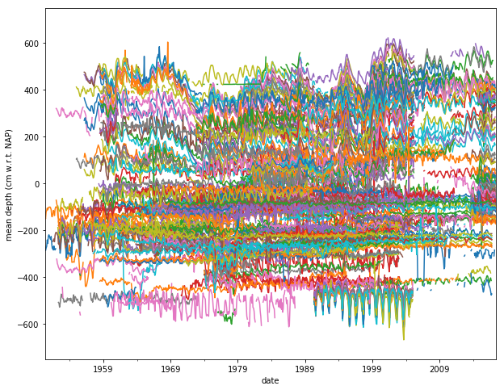

# subsurface_hackathon_2017
*Three notebooks to jump start a data science project*

This repository is associated with a post on my [blog](http://geophysicslabs.com/2017/06/19/three-notebooks-to-jump-start-a-data-science-project/).

---
The three Jupyter notebooks that you will find here were originally written during the [Subsurface Hackathon](https://agilescientific.com/blog/2017/6/13/le-grand-hack) that took place in Paris in June 2017. [Martin Bentley](https://github.com/mtb-za) and I were in a team that tried to exploit the free availability of groundwater data from the [Geological Survey of the Netherlands](https://www.dinoloket.nl/en).

The notebooks provide some examples written in Python for tackling this project, but I think the code is pretty generic and can be used for a large range of other data science projects, especially in geology or geophysics. 

While much more is certainly possible to achieve with this dataset, I hope this work can help anyone who wants to start a data science project using open data, Python, the pandas library, and Jupyter notebooks.

## Requirements

- Python 3.5
- pandas 0.20
- matplotlib 2.0
- numpy 1.12
- Scipy 0.19
- ipywidgets 6.0
